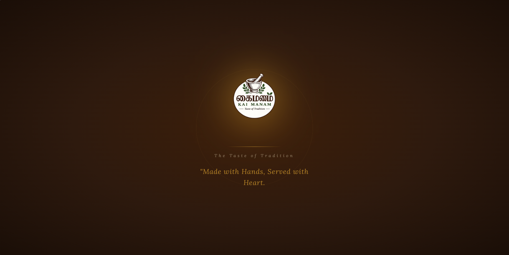
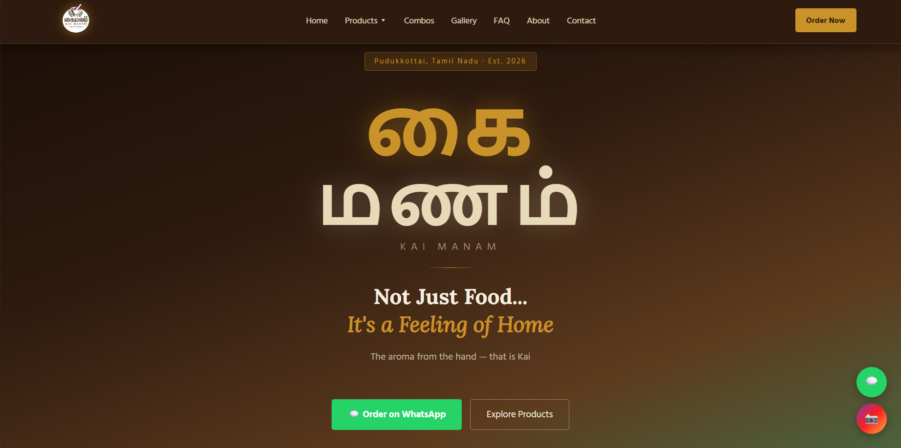
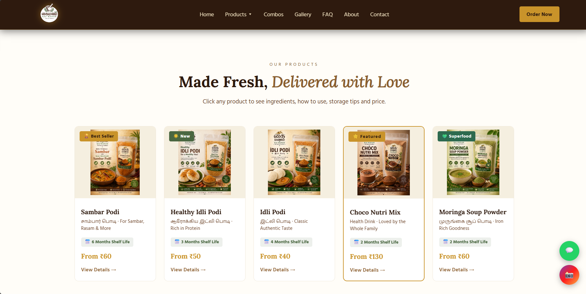
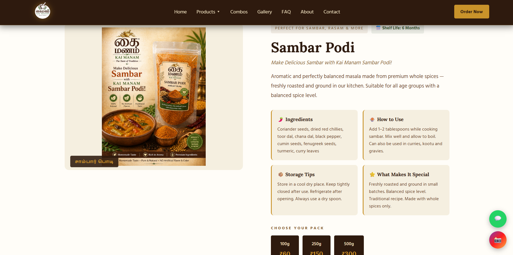
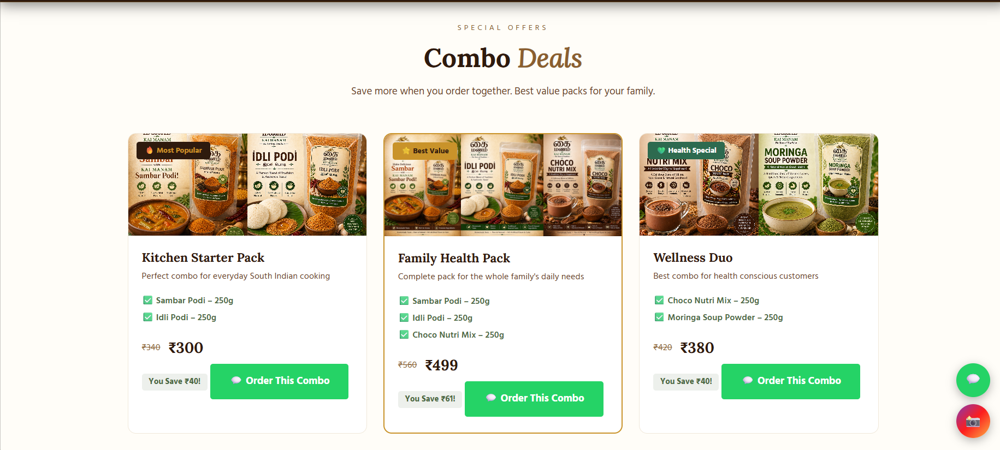
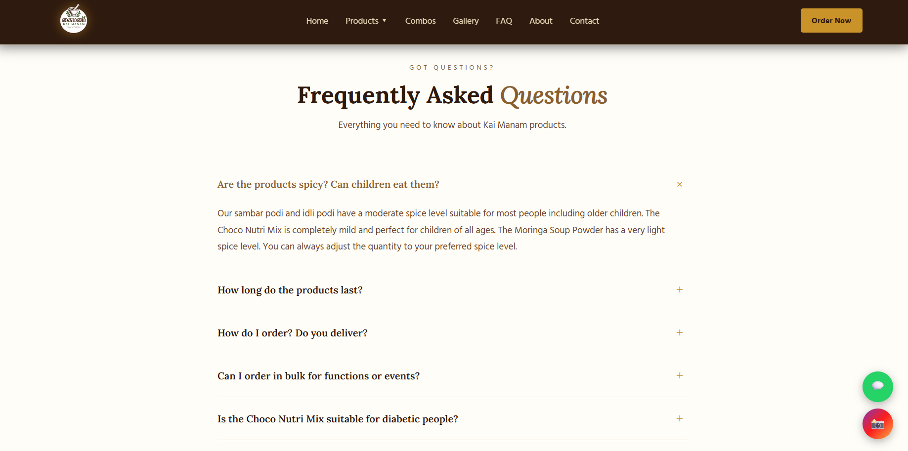
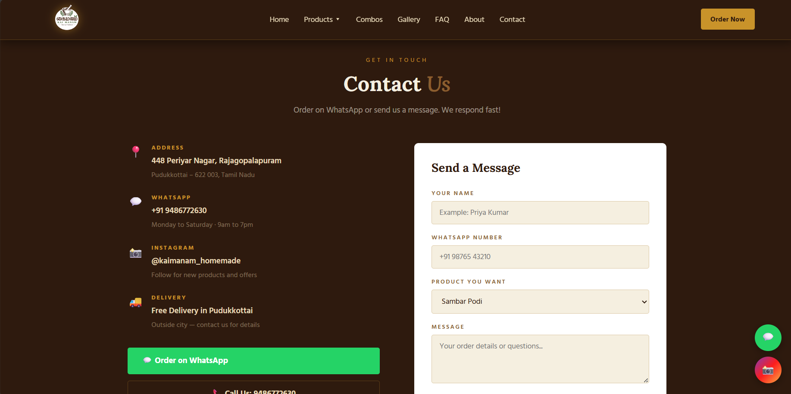
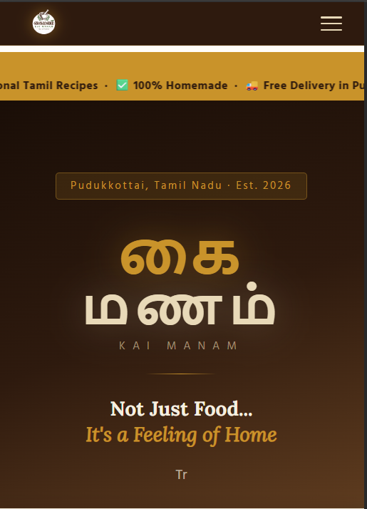

# 🌶️ Kai Manam – Homemade Masala Powders Website
### Task 3 | Full Stack Web Development | Future Interns 2026
A real-world business website built to help a local brand grow online and attract customers.
---

## 📸 Website Preview

### Loading Screen


### Hero Section


### Products


### Product Detail Page


### Combo Deals


### FAQ


### Contact Page


### Mobile View


---

## 🏪 About the Business

**Business Name:** Kai Manam (கை மணம்)
**Tagline:** The Taste of Tradition
**Type:** Homemade Masala & Health Powder Business
**Location:** 448 Periyar Nagar, Rajagopalapuram,
Pudukkottai – 622 003, Tamil Nadu
**Started:** 2026
**WhatsApp:** +91 9486772630
**Instagram:** [@kaimanam_homemade](https://www.instagram.com/kaimanam_homemade)

---

## ❓ The Problem

Kai Manam is a brand new homemade spice business started
in 2026 in Pudukkottai, Tamil Nadu. Despite having
high quality products and beautiful branding, the business
had no website and only 199 Instagram followers.

This meant:
- New customers could not discover them online
- No platform to show product details or ingredients
- No way to build trust for a homemade food brand
- No professional identity beyond Instagram posts
- Customers had no easy way to place orders

---

## ✅ The Solution — What This Website Does

This website gives Kai Manam a complete professional
online presence that works 24/7 to attract and
convert customers.

### Pages Built
| Page | Purpose |
|------|---------|
| Home | Brand introduction with hero, products preview and story |
| Sambar Podi | Full product detail with ingredients and price |
| Healthy Idli Podi | Full product detail with ingredients and price |
| Idli Podi | Full product detail with ingredients and price |
| Choco Nutri Mix | Full product detail with ingredients and price |
| Moringa Soup Powder | Full product detail with ingredients and price |
| Combos | Special bundle deals to increase order value |
| Gallery | Showcase of all product photography |
| FAQ | Answers 7 common customer questions automatically |
| About | Family story and brand values |
| Contact | WhatsApp, call, form and Google Maps |

---

## 🌟 Key Highlights
- Built for a real local business (not a dummy project)
- Focused on solving real customer problems
- Integrated WhatsApp for direct ordering
- Designed mobile-first for local users
- Includes combo deals to increase order value

---

### Features Built
- ✅ Animated loading screen with brand logo and typing quote
- ✅ Scrolling delivery information banner
- ✅ Full product pages with ingredients, how to use, storage tips
- ✅ Interactive pack size selector with animation
- ✅ WhatsApp order button sends selected pack details automatically
- ✅ Customer review submission form via WhatsApp
- ✅ Combo deals section with savings calculator
- ✅ FAQ section with smooth accordion animation
- ✅ Google Maps embed showing exact location
- ✅ Direct call button for instant contact
- ✅ Instagram integration
- ✅ Hamburger menu for mobile
- ✅ Sticky WhatsApp order button on mobile
- ✅ Floating WhatsApp and Instagram buttons on desktop
- ✅ Page transition animations
- ✅ Typing text animation in hero section
- ✅ Fully responsive on all screen sizes

---

## 💼 Business Pitch

### Who is Kai Manam?
Kai Manam is a homemade masala powder brand from
Pudukkottai, Tamil Nadu. The name means the aroma
from the hand in Tamil — reflecting their commitment
to handcrafted, traditional cooking. They sell 5
products: Sambar Podi, Healthy Idli Podi, Idli Podi,
Choco Nutri Mix and Moringa Soup Powder.

### What Problem Does the Website Solve?
Before this website, Kai Manam had no way for new
customers to find them, trust them or order from
them online. Homemade food businesses especially
need trust — customers need to see ingredients,
preparation methods and brand story before they buy.
A plain Instagram page cannot provide this.

### How Does It Attract Customers?
1. **Professional first impression** — premium design
   matches their high quality branding
2. **Full product transparency** — every product shows
   ingredients, how to use, storage tips and shelf life
3. **Easy ordering** — WhatsApp button pre-fills the
   order message with selected pack size and price
4. **Combo deals** — encourages customers to buy more
   with attractive bundle savings
5. **FAQ section** — removes buying hesitation by
   answering common questions automatically
6. **Google Maps** — customers can find them easily
7. **Mobile first** — most customers in Pudukkottai
   will visit on mobile — fully optimized
8. **Review system** — customers can submit reviews
   via WhatsApp building social proof over time

---

## 🛠️ Tools & Technologies Used

| Tool | Purpose |
|------|---------|
| HTML5 | Website structure and content |
| CSS3 | Styling, animations and responsive design |
| JavaScript | Page switching, animations, WhatsApp integration |
| Google Fonts | Lora and Hind Madurai for warm traditional feel |
| GitHub Pages | Free hosting and deployment |
| VS Code | Code editor |
| remove.bg | Logo background removal |
| Claude AI | Design guidance and learning support |

---

## 🌐 Live Website
👉 [Click here to view live website](https://anusuya2005.github.io/FUTURE_FS_03/)

---

## 📁 Repository Structure
```
FUTURE_FS_03/
├── index.html          — Complete website HTML
├── style.css           — All styling and animations
├── script.js           — JavaScript functionality
├── logo.png            — Kai Manam brand logo
├── sambar.png          — Sambar Podi product image
├── healthyidli.png     — Healthy Idli Podi product image
├── idli.png            — Idli Podi product image
├── choco.png           — Choco Nutri Mix product image
├── moringa.png         — Moringa Soup Powder product image
├── README.md           — Project documentation
└── screenshots/
    ├── 01-loader.png
    ├── 02-hero.png
    ├── 03-products.png
    ├── 04-product-detail.png
    ├── 05-combos.png
    ├── 06-faq.png
    ├── 07-contact.png
    └── 08-mobile.png
```
---

## 👨‍💻 Developer Note

This website was built as Task 3 of the Future Interns
Full Stack Web Development track. It is a real website
for a real family business — not a fictional project.
Every feature was built with the actual business needs
of Kai Manam in mind, from the WhatsApp ordering system
to the combo deals designed to increase average order value.

The goal was not just to complete a task but to deliver
something that genuinely helps a small business grow online.

---

*Built with ❤️ for Kai Manam — Pudukkottai, Tamil Nadu*
*Future Interns · Full Stack Web Development · Task 3 · 2026*